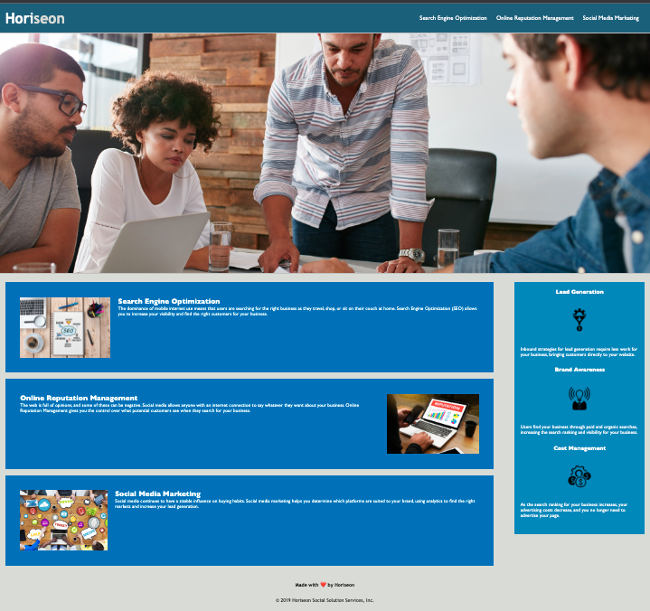

# css-homework-demo

## Horiseon Marketing Project

Goal: Reengineer webpage utilizing semantic HTML, and adhere to accessibility standards

Actions:
1. Implement semantic HTML replacing unspecified and non destriptive tags
2. Ensure and fixed functionality of links
3. Provide alt attributes to pertinent images
4. Structure HTML elements to flow logically
5. Correct heading attributes to sequential order
6. Update title to be concise and descriptive
7. Structure CSS to flow logically
8. Consolidate CSS selectors and properties
9. Add comments to HTML & CSS for understanding
10. Added browser instructions to adjusting viewing based on device (tablet/phone/desktop)
11. Create a README.md 

## Demo

https://salissa4.github.io/css-homework-demo/

## Credits

Edited: Tomas Diaz https://github.com/tomasdiaz83

## License

MIT License

Copyright (c) [2022] [Salissa4]

Permission is hereby granted, free of charge, to any person obtaining a copy
of this software and associated documentation files (the "Software"), to deal
in the Software without restriction, including without limitation the rights
to use, copy, modify, merge, publish, distribute, sublicense, and/or sell
copies of the Software, and to permit persons to whom the Software is
furnished to do so, subject to the following conditions:

The above copyright notice and this permission notice shall be included in all
copies or substantial portions of the Software.

THE SOFTWARE IS PROVIDED "AS IS", WITHOUT WARRANTY OF ANY KIND, EXPRESS OR
IMPLIED, INCLUDING BUT NOT LIMITED TO THE WARRANTIES OF MERCHANTABILITY,
FITNESS FOR A PARTICULAR PURPOSE AND NONINFRINGEMENT. IN NO EVENT SHALL THE
AUTHORS OR COPYRIGHT HOLDERS BE LIABLE FOR ANY CLAIM, DAMAGES OR OTHER
LIABILITY, WHETHER IN AN ACTION OF CONTRACT, TORT OR OTHERWISE, ARISING FROM,
OUT OF OR IN CONNECTION WITH THE SOFTWARE OR THE USE OR OTHER DEALINGS IN THE
SOFTWARE.

## Badges

